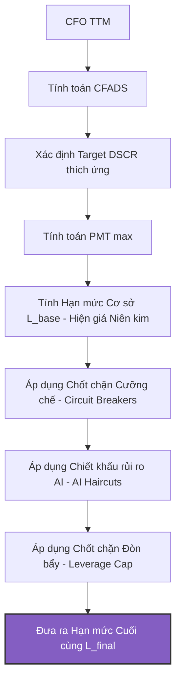

### I. Kiến trúc Tổng quan Quy trình Định mức Tín dụng

Quy trình tính toán hạn mức tín dụng tối đa khả thi ($L_{final}$) của doanh nghiệp trải qua 6 bước toán học và kiểm soát rủi ro tuần tự:

---

### II. Khung Toán học & Logic Định mức Chi tiết

#### 1. Dòng tiền Khả dụng Trả nợ (CFADS - Cash Flow Available for Debt Service)
Điểm khởi đầu để xác định năng lực vay nợ là dòng tiền hoạt động kinh doanh lũy kế 4 quý gần nhất ($CFO_{TTM}$), loại bỏ các dòng tiền phi cốt lõi:
$$CFADS = \max(CFO_{TTM}, 0.0)$$

*Chú ý:* Nếu $CFADS \le 0$, hạn mức tín dụng lập tức bị cưỡng chế về $0$. Hệ thống từ chối cấp tín dụng mới cho doanh nghiệp không tự tạo ra thặng dư tiền mặt từ lõi vận hành.

#### 2. Hệ số DSCR Mục tiêu Thích ứng (Dynamic Target DSCR)
Thay vì áp dụng hệ số DSCR tĩnh thông thường (ví dụ: $1.20x$), chương trình tự động điều chỉnh tăng biên an toàn (DSCR mục tiêu) thông qua các khoản phạt rủi ro tài chính và rủi ro phá sản dự báo từ AI:

$$DSCR_{target} = DSCR_{base} + \Delta DSCR_{Inventory} + \Delta DSCR_{Capital} + \Delta DSCR_{WorkingCapital} + \Delta DSCR_{AI}$$

Trong đó:
*   **$DSCR_{base}$ (Hệ số nền):** Cố định ở mức $1.20$.
*   **$\Delta DSCR_{Inventory}$ (Phạt ứ đọng tồn kho):** Cộng thêm **$0.30$** nếu tỷ lệ Hàng tồn kho / Tổng tài sản ($Inventory/TA$) $> 40\%$.
*   **$\Delta DSCR_{Capital}$ (Phạt đòn bẩy cao):** Cộng thêm **$0.30$** nếu tỷ lệ Vốn chủ sở hữu / Tổng Nợ ($Equity/Debt$) $< 0.30$.
*   **$\Delta DSCR_{WorkingCapital}$ (Phạt thâm hụt thanh khoản):** Cộng thêm **$0.20$** nếu Vốn lưu động ròng âm ($Working\ Capital / TA < 0$).
*   **$\Delta DSCR_{AI}$ (Phạt rủi ro dự báo bởi AI):** Tăng tuyến tính theo xác suất vỡ nợ dự báo từ mô hình XGBoost:
    $$\Delta DSCR_{AI} = \frac{PD_{XGBoost}}{100}$$

#### 3. Số tiền Trả nợ Hàng năm Tối đa (PMT_max)
Nghĩa vụ trả nợ gốc và lãi tối đa doanh nghiệp được phép gánh chịu mỗi năm được xác định bằng:
$$PMT_{max} = \frac{CFADS}{DSCR_{target}}$$

#### 4. Hạn mức Cơ sở ($L_{base}$) - Công thức Niên kim (Annuity Formula)
Để quy đổi dòng niên kim trả nợ hàng năm thành tổng quy mô khoản vay gốc ($L_{base}$), hệ thống sử dụng công thức hiện giá của niên kim đều với lãi suất cho vay giả định ($r$) và kỳ hạn vay ($n$, tính bằng năm):

$$L_{base} = PMT_{max} \times \left[ \frac{1 - (1 + r)^{-n}}{r} \right]$$

---

### III. Hệ thống Chốt chặn & Chiết khấu Rủi ro (Safety Guards)

Sau khi tính được $L_{base}$, hệ thống quét qua các tầng bảo vệ để xác định hạn mức cuối cùng $L_{final}$:

#### 1. Bộ Chốt chặn Cưỡng chế (Circuit Breakers)
Hệ thống lập tức từ chối cho vay ($L_{final} = 0.0$) nếu doanh nghiệp vi phạm bất kỳ điều kiện nào sau đây:

| Loại Chốt chặn | Điều kiện ngắt mạch | Mô tả kỹ thuật |
| :--- | :--- | :--- |
| **AI Circuit Breaker** | $PD_{XGBoost} > 55.0\%$ hoặc $Risk\ Level \ge 4$ | Xác suất phá sản vượt quá ngưỡng kiểm soát rủi ro tối đa của hệ thống. |
| **ICR Breaker** | $Interest\ Coverage\ Ratio (ICR) < 1.0$ | Khả năng trả lãi từ dòng tiền hiện tại dưới $1.0x$ (không đủ trả lãi vay cũ). |
| **Vốn chủ sở hữu âm** | $Equity \le 0$ | Doanh nghiệp đã mất vốn chủ sở hữu hoàn toàn (phá sản kỹ thuật). |
| **Dòng tiền âm** | $CFADS \le 0$ | Không có thặng dư tiền mặt từ hoạt động kinh doanh để trả nợ. |

#### 2. Chiết khấu Rủi ro AI (AI Haircuts)
Đối với doanh nghiệp chưa vi phạm chốt chặn nhưng thuộc diện giám sát rủi ro, hạn mức sẽ bị khấu trừ trực tiếp:
*   **Hạng rủi ro Level 2 (Watch - Cảnh báo):** Chiết khấu $15\%$ hạn mức.
    $$L_{final} = L_{base} \times 0.85$$
*   **Hạng rủi ro Level 3 (Stress - Căng thẳng):** Chiết khấu $40\%$ hạn mức.
    $$L_{final} = L_{base} \times 0.60$$

#### 3. Chốt chặn Đòn bẩy Bảng Cân đối (Balance Sheet Leverage Cap)
Đảm bảo doanh nghiệp duy trì một tấm đệm vốn tự có an toàn tối thiểu là **$15\%$** trên tổng quy mô nợ phải trả sau khi nhận thêm khoản vay mới ($L_{final}$):
$$\frac{Equity}{Total\ Debt + L_{final}} \ge 0.15 \implies L_{final} \le \frac{Equity}{0.15} - Total\ Debt$$

Do đó, giới hạn đòn bẩy tối đa đối với dư nợ mới được xác định là:
$$Leverage\ Cap = \max\left( 0.0, \frac{Equity}{0.15} - Total\ Debt \right)$$

Nếu $L_{final} > Leverage\ Cap$, hệ thống sẽ tự động cưỡng chế cắt giảm $L_{final}$ về đúng bằng $Leverage\ Cap$.

---

### IV. Khung Chấm điểm Dòng tiền và Phân hạng Quyết định

Bên cạnh mô hình định lượng hạn mức, hệ thống chạy song song **BCTC Cash Flow Scorecard** để chấm điểm doanh nghiệp trên thang điểm `[300, 1000]` qua 6 chỉ tiêu cốt lõi:

1. **Cash-to-Revenue Ratio** (Tối đa 20 điểm): Đo lường tỷ lệ tiền thu từ bán hàng / Doanh thu thuần.
2. **CFO-based DSCR** (Tối đa 25 điểm): Khả năng dòng tiền CFO bao phủ gốc lãi vay dài hạn phân bổ đều.
3. **Cash Buffer Days** (Tối đa 15 điểm): Số ngày đệm tiền mặt để duy trì chi phí hoạt động thường nhật.
4. **Revenue Volatility** (Tối đa 15 điểm): Độ biến động doanh thu 8 quý gần nhất.
5. **Equity to Debt** (Tối đa 15 điểm): Tỷ lệ Vốn chủ sở hữu / Nợ vay chịu lãi.
6. **CFO Growth (YoY)** (Tối đa 10 điểm): Tăng trưởng dòng tiền hoạt động kinh doanh hàng năm.

#### Cơ chế Phân loại Hạng và Quyết định Tín dụng Tự động:

| Khoảng Điểm | Xếp Hạng (Grade) | Quyết Định Tín Dụng Áp Dụng | Chỉ thị Giao diện |
| :--- | :--- | :--- | :--- |
| **$\ge 850$** | **Grade A+** | **Auto-approve**: Phê duyệt tự động, áp dụng chính sách lãi suất ưu đãi. | Xanh lá sáng |
| **$[700, 850)$** | **Grade A** | **Auto-approve**: Phê duyệt tự động với lãi suất thông thường. | Xanh lá |
| **$[600, 700)$** | **Grade B** | **Conditional Approve**: Phê duyệt tự động kèm điều khoản kiểm soát dòng tiền/tài khoản thu hộ. | Xanh dương |
| **$[500, 600)$** | **Grade C** | **Manual Review**: Bắt buộc Hội đồng tín dụng phê duyệt tay; áp dụng tối thiểu 20% Haircut. | Cam |
| **$< 500$** | **Grade D** | **Reject (Từ chối)**: Từ chối cấp hạn mức tự động do rủi ro dòng tiền rất cao. | Đỏ |

---

### V. Tài liệu tham khảo & Nguồn dữ liệu (References & Resources)

1. **Thuật toán & Ý tưởng nền tảng**: Được tham khảo và kế thừa cấu trúc logic định mức từ dự án [Tai_lanh_-_Talent](https://github.com/wane-bs/Tai_lanh_-_Talent).
2. **Mô hình ngôn ngữ lớn xác thực nhãn (Fraud Label Validator)**: Sử dụng mô hình chuyên biệt toán học **Qwen 2.5 Math** (phiên bản cấu hình nhẹ `mightykatun/qwen2.5-math:1.5b`), được triển khai cục bộ qua Ollama tại địa chỉ: [Ollama mightykatun/qwen2.5-math:1.5b](https://ollama.com/mightykatun/qwen2.5-math:1.5b).
3. **Bộ dữ liệu gốc**: Dữ liệu giao dịch ngân hàng giả lập được trích xuất từ cấu trúc bảng của: [Xomdata Banking Schema Dataset](https://dataset.xomdata.com/datasets/schema/banking).